# 📘 LearnDL 学习记录

虽然之前已经接触过一些深度学习的知识，但光有理论、动手实践太少。  
决定跟着《动手学深度学习：PyTorch版》重新敲一遍代码，以此仓库作为记录。

---

## ✅ 第二章：数学基础（张量、线性代数、概率、微积分）

- **梯度和反向传播**
  - 前向传播时设置 `require_grad=True` 保存计算图
  - 反向传播后自动计算梯度
  - 使用 SGD、Adam 等优化算法更新参数

---

## ✅ 第三章：线性神经网络（线性回归与 Softmax 回归）

- **线性回归**
  - 损失函数：MSELoss（均方误差）
- **Softmax 回归**
  - 用于分类问题，损失函数为交叉熵

---

## ✅ 第四章：多层感知机（MLP）

- 引入激活函数以增加非线性
- **过拟合**与**欠拟合**
  - 模型复杂度大但数据小易过拟合
- **解决方法：**
  - **权重衰减（L2 正则化）**
  - **暂退法（Dropout）**：每个全连接层后添加 Dropout 层

---

## ✅ 第五章：深度学习计算

- **块（Block）与层（Layer）**
  - 自定义块继承 `nn.Module`
  - 构造函数中初始化参数，`forward()`定义前向传播

- **参数管理**
  - 索引访问某一层参数
  - 一次性访问全部参数
  - 嵌套块中收集参数

- **读写模型参数**
  - 保存模型参数：`torch.save`
  - 加载模型参数：`torch.load`

---

## ✅ 第六章：卷积神经网络（CNN）

- 卷积的作用：**平移不变性、局部感知**
- **汇聚层（Pooling）**：降低位置敏感性和采样敏感性
- 经典网络：**LeNet**

---

## ✅ 第七章：现代卷积神经网络

### 🔹 AlexNet

> 更深的网络结构，使用 ReLU、Dropout 和数据增强  
> 

### 🔹 VGG

> 网络由多个相同结构的块重复构建  
> 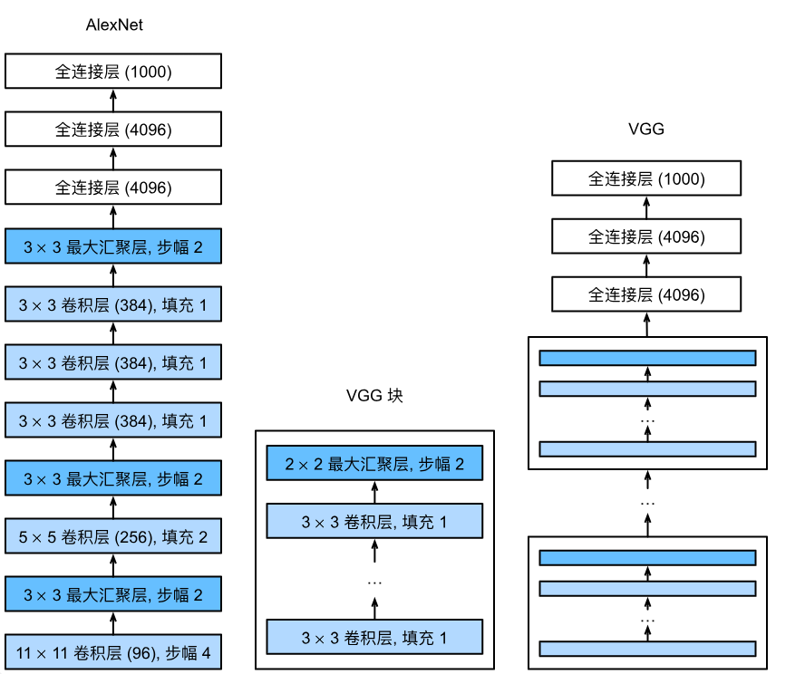

### 🔹 NiN（Network in Network）

> 使用 `1x1` 卷积，取消全连接层  
> 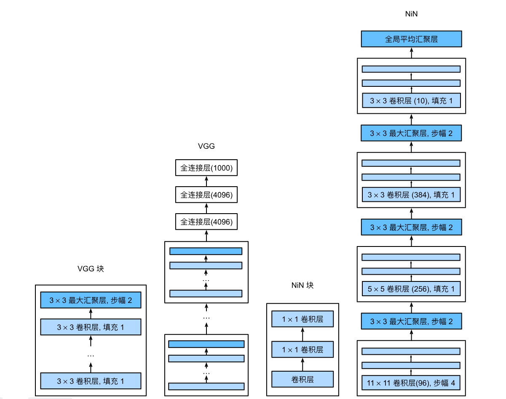

### 🔹 GoogLeNet（Inception）

> 并行路径结构，`Inception` 块为核心  
> 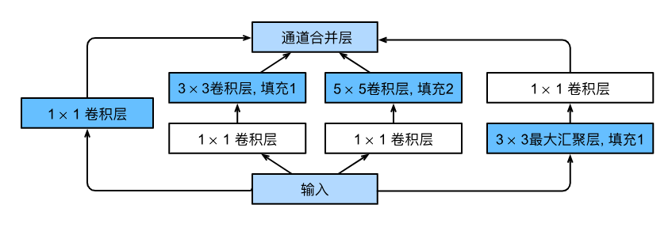
> 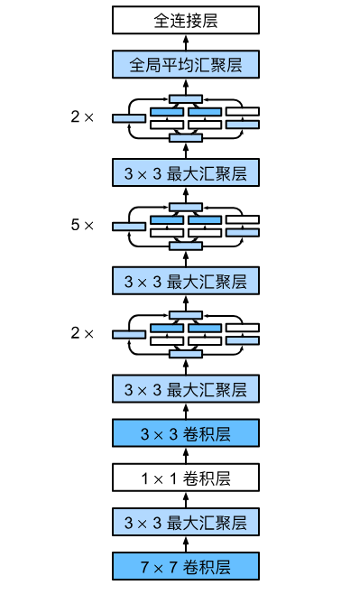

### 🔹 批量规范化（BatchNorm）

- 每次迭代对输入规范化（减均值、除标准差）
- 保持分布稳定，加速收敛

### 🔹 ResNet（残差网络）

> 通过**跳跃连接**学习“变化量”而非全部  
> 
> 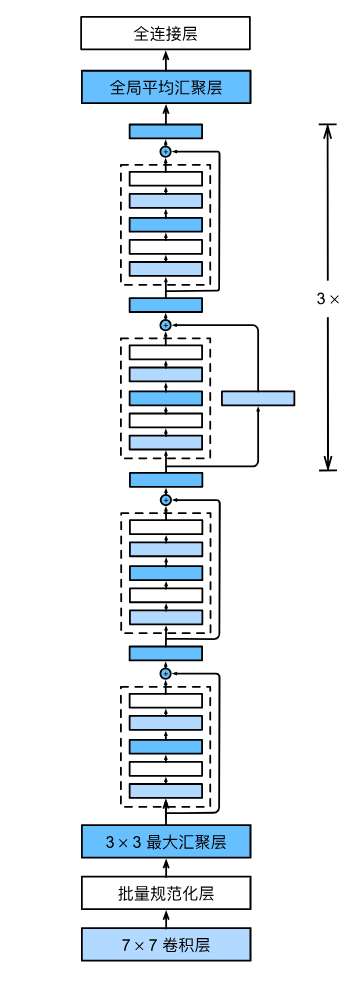

### 🔹 DenseNet（稠密连接网络）

> 组成：**稠密块 + 过渡层**  
> 
> 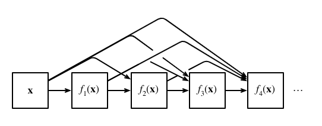

---

## ✅ 第八章：循环神经网络（RNN）

### 🔹 文本预处理

1. 加载文本字符串  
2. 拆分词元  
3. 建立词表  
4. 转换为索引序列

### 🔹 RNN 基本结构

- 具有**隐状态**
- 前向传播：
  $$
  \mathbf{H}_t = \phi(\mathbf{X}_t \mathbf{W}_{xh} + \mathbf{H}_{t-1} \mathbf{W}_{hh} + \mathbf{b}_h)
  $$
  $$
  \mathbf{O}_t = \mathbf{H}_t \mathbf{W}_{hq} + \mathbf{b}_q
  $$

- **BPTT（反向传播）**：可能导致梯度消失或爆炸 → 使用**梯度截断**
- 使用**困惑度**评估模型性能  

---

## ✅ 第九章：现代 RNN

### 🔹 GRU（门控循环单元）

> 引入**重置门**与**更新门**  
> 

### 🔹 LSTM（长短期记忆网络）

> 引入**记忆元**、**输入/输出/遗忘门**  
> 
> 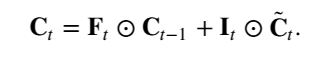
> 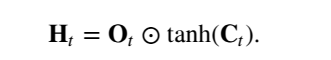
> 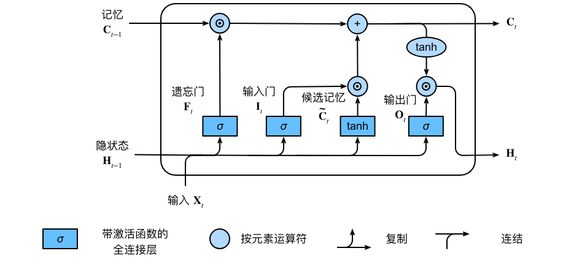

### 🔹 深度 RNN

> 多层结构，信息流向更多路径  
> 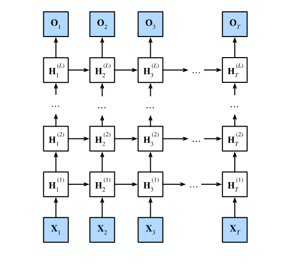

### 🔹 编码器 - 解码器架构（Encoder - Decoder）

> 编码器压缩序列 → 解码器生成目标序列  
> 

### 🔹 Seq2Seq（序列到序列）

- 机器翻译常见
- 强制教学 + 遮蔽机制
- 评估指标：**BLEU**

---

## ✅ 第十章：注意力机制与 Transformer

### 🔹 注意力提示与汇聚

> 查询（Query）、键（Key）、值（Value）  
> 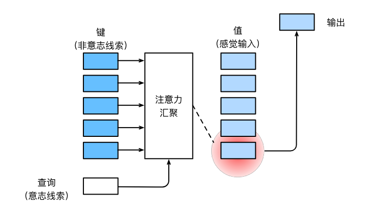

- **不带参数汇聚：**
  
  
- **带参数汇聚：**
  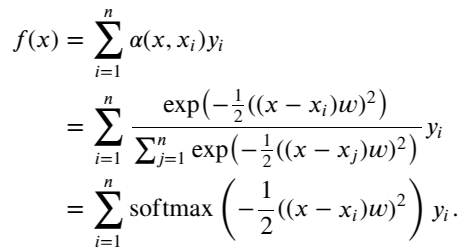

### 🔹 注意力评分函数

- 标准流程：
  
  
- 加性 vs 缩放点积注意力：
  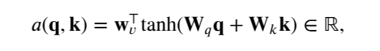
  

### 🔹 Bahdanau 注意力

> 解码器中引入注意力机制  
> 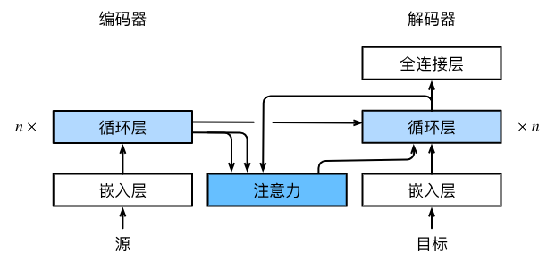

### 🔹 多头注意力（Multi-Head Attention）

> 并行计算多个注意力头  
> 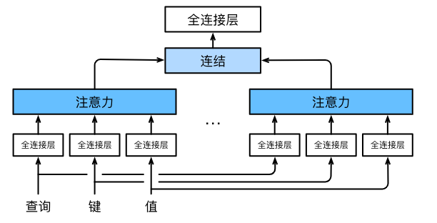

### 🔹 自注意力与位置编码

- **自注意力：**
  
  
- **位置编码：**
  

### 🔹 Transformer 模型

- 完全基于注意力机制
- 不含卷积或循环层
- **多头自注意力 + 残差连接 + 层规范化**
- **位置前馈网络（MLP）**
- 架构图：  
  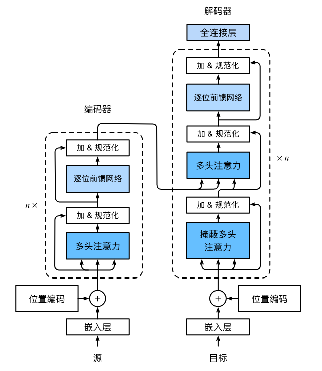

---