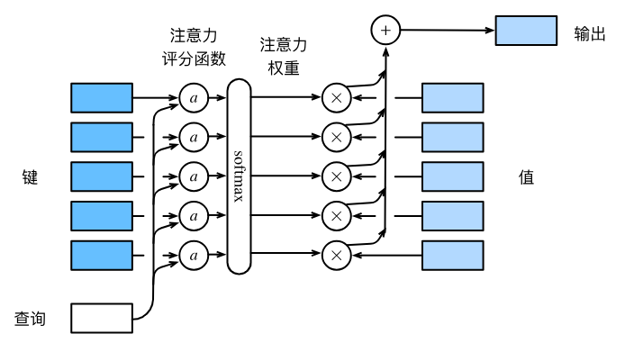

typora-copy-images-to: assets

# learnDL
虽然之前已经接触过了一些深度学习的东西，但光有理论，动手实践太少，决定跟着《动手学深度学习：Pytorch版》再动手把代码敲一遍，以此仓库作为记录

- [x] 第二章主要是一些张量的操作、线性代数、概率论、微积分的一些预备知识
  - [x] 很重要的一点就是梯度和反向传播
  - [x] 在前向传播的时候可以设置`require_grad=True`来保存计算图，以便反向传播的时候计算各个参数的梯度，计算出梯度之后使用SGD、Adam等优化算法对参数进行更新
  
- [x] 第三章介绍了线性神经网络，包括最简单的线性回归以及Softmax回归
  - [x] 线性回归，常采用均方误差MSELoss作为损失函数
  - [x] Softmax回归处理分类问题，使用交叉熵损失作为损失函数
  
- [x] 第四章介绍了多层感知机，通过引入激活函数引入了非线性因素，还讨论了过拟合、欠拟合及其解决方法，最后还有一个kaggle房价预测的实战
  - [x] 模型复杂度较高（参数较多或者参数取值范围较大）但是数据集小，或者特征数量多而数据集小，容易导致**过拟合**，可以理解为背答案
  - [x] **权重衰减**作为最广泛的正则化技术之一，可以缓解过拟合，权重衰减的核心是在损失函数上面加上权重的L2范数（或者其他），使L2范数尽可能小来降低模型复杂度，进而避免过拟合
  - [x] **暂退法**是以p的概率丢弃隐藏层单元，只需要在每个全连接层之后添加一个暂退层，可以提高模型的平滑性（函数不应该对其输入的微小变化敏感），进而缓解过拟合
  
- [x] 第五章名为深度学习计算，引入了层和块的概念，还介绍了参数管理的细节，以及读写文件
  - [x] 从编程的角度来看，**块**由类表示，自定义的块通过继承`nn.Module`类来实现，在类中需要设置前向传播函数`forward`，在构造函数中需要定义参数的初始化
  - [x] 在参数管理中，可以通过索引访问任意层并查看该层的参数||一次性访问所有参数||从嵌套块中收集参数，参数的初始化可以采用框架提供的初始化方式也可以自定义
  - [x] 加载和保存模型参数的文件读写操作通过`torch.save`和`torch.load`来实现
  
- [x] 第六章介绍了卷积神经网络，主要讲了卷积运算、填充、步幅、多通道、池化/汇聚层、`LeNet`
  - [x] 采用卷积是为了满足平移不变性和局部性
  - [x] 池化层/汇聚层 Pooling，起到汇聚、聚拢信息的作用：降低卷积层对位置的敏感性；降低对空间降采样表示的敏感性
  - [x] 最早的卷积神经网络之一 `LeNet`
  
- [x] 第七章介绍了现代卷积神经网络，按照时间发展的顺序进行介绍

  - [x] `AlexNet`：比`LeNet`更深，是一种深度卷积神经网络

    

  - [x] `VGG`：使用许多重复的神经网络块的网络，通过构建块来便于构建网络时的复用

    

  - [x] `NiN`：网络中的网络——在每个像素的通道上分别使用多层感知机，从而防止丢失空间结构的信息，主要是采用1x1卷积来实现，其取消了使用全连接层，转而使用一个`nin`块来替代

    

  - [x] `GoogLeNet`：含并行连接的网络，其基本的卷积块称为`Inception`块，块中包含四条并行的路径

    

  - [x] 批量规范化：可持续加速深层网络的收敛

    - [x] 原理：每次训练迭代中，首先规范化输入——减去其均值并除以其标准差（基于当前的小批量处理）；接下来应用比例系数和比例偏移

  - [x] `ResNet`：残差网络，其跳跃连接机制让网络学“变化量”而不是“全部”，因此更容易训练更深、效果更好，这就好像网络不用学“从 0 到目标”，而是只学“和输入相比改了多少”

    

  - [x] `DenseNet`：稠密连接网络，主要由两部分组成：稠密块、过渡层  稠密块定义如何连接输入和输出，过渡层控制通道数，使其不会太复杂

    
  
- [x] 第八章介绍了`RNN`循环神经网络

  - [x] 序列模型：自回归模型、隐变量自回归模型、马尔科夫模型...

  - [x] 文本预处理——为训练文本序列模型的准备工作。包含步骤：

    - [x] 1.将文本作为字符串加载到内存
    - [x] 2.将字符串拆分成词元
    - [x] 3.建立词表，将词元映射到数字索引
    - [x] 4.将文本转换成数字索引序列，方便模型操作

  - [x] `RNN`——循环神经网络：是具有**隐状态**的神经网络，基于循环计算的隐状态神经网络

    - [x] `RNN`在训练时交替使用==前向传播==和==通过时间反向传播(BPTT)==

    - [x] 前向传播：

      - [x] $$\mathbf{H}_t = \phi(\mathbf{X}_t \mathbf{W}_{xh} + \mathbf{H}_{t-1} \mathbf{W}_{hh}  + \mathbf{b}_h).$$
      - [x] $$\mathbf{O}_t = \mathbf{H}_t \mathbf{W}_{hq} + \mathbf{b}_q.$$

    - [x] 在反向传播计算梯度的时候，矩阵的高次幂会导致梯度爆炸或者梯度消失，需要采取**梯度截断**的措施

    - [x] 使用**困惑度**来衡量`RNN`的好坏

      
  
- [x] 第九章介绍了现代循环神经网络，包括门控循环单元`GRU`、长短期记忆网络`LSTM`、深度`RNN`、双向`RNN`、编码器-解码器架构

  - [x] 门控循环单元`GRU`
    - [x] 设置有**重置门**和**更新门**，可以帮助解决梯度消失的问题，并更好地捕获时间步很长的序列的依赖关系
    - [x] 公式
      - [x] 𝐑𝑡=𝜎(𝐗𝑡𝐖𝑥𝑟+𝐇𝑡−1𝐖ℎ𝑟+𝐛𝑟),
      - [x] 𝐙𝑡=𝜎(𝐗𝑡𝐖𝑥𝑧+𝐇𝑡−1𝐖ℎ𝑧+𝐛𝑧),
      - [x] 𝐇̃ 𝑡=tanh(𝐗𝑡𝐖𝑥ℎ+(𝐑𝑡⊙𝐇𝑡−1)𝐖ℎℎ+𝐛ℎ),
      - [x] 𝐇𝑡=𝐙𝑡⊙𝐇𝑡−1+(1−𝐙𝑡)⊙𝐇̃ 𝑡.
    - [x] 
  - [x] 长短期记忆网络`LSTM`
    - [x] 引入**记忆元**，设置有**输入门**、**输出门**、**遗忘门**，同样有助于缓解梯度消失、梯度爆炸的问题，有利于获取序列中的**长距离依赖关系**
    - [x] 公式
      - [x] 
      - [x] 
      - [x] 
    - [x] 
  - [x] 深度`RNN`
    - [x] 与单层的循环神经网络相比，deepRNN具有多个隐藏层，隐状态的信息被传递到当前层的下一时间步和下一层的当前时间步
    - [x] 结构图
      - [x] 
  - [x] 编码器-解码器架构
    - [x] 编码器将长度可变的序列作为输入，并将其转换为具有固定形状的编码状态。
    - [x] 解码器将具有固定形状的编码状态映射为长度可变的序列。
    - [x] 结构图
      - [x] 
  - [x] 序列到序列学习`seq2seq`
    - [x] 以机器翻译为例子
    - [x] 根据“编码器-解码器”架构的设计， 我们可以使用两个==循环神经网络==来设计一个序列到序列学习的模型。
    - [x] 在实现编码器和解码器时，我们可以使用多层循环神经网络。
    - [x] 我们可以使用遮蔽来过滤不相关的计算，例如在计算损失时。
    - [x] 在“编码器－解码器”训练中，强制教学方法将原始输出序列（而非预测结果）输入解码器。
    - [x] `BLEU`是一种常用的评估方法，它通过测量预测序列和标签序列之间的 𝑛 元语法的匹配度来评估预测。
  
- [x] 第十章介绍了注意力机制，主要内容包括：注意力提示、注意力汇聚、注意力评分函数、Bahdanau 注意力、多头注意力、自注意力、位置编码、Transformer模型

  - [x] 注意力提示
    - [x] “是否包含自主性提示”将**注意力机制**与**全连接层或汇聚层**区别开来
    - [x] 自主性提示被称为**查询（query）**
    - [x] 注意力机制通过注意力汇聚使选择偏向于**值（感官输入）**，其中包含**查询（自主性提示）**和**键（非自主性提示）**。键和值是成对的。
    - [x] 关系示意图
      - [x] 

  - [x] 注意力汇聚
    - [x] 分为**带参数**的注意力汇聚和**不带参数**的注意力汇聚
    - [x] Nadaraya-Watson的非参数注意力汇聚根据输入的位置对输出y_i进行加权，Nadaraya-Watson核回归是一个非参数模型，也就是说它不能被学习
    - [x] 不带参数的
      - [x] 

    - [x] 带参数的
      - [x] 

  - [x] 注意力评分函数
    - [x] 标准流程：键、查询 -> 注意力评分函数a -> softmax函数 -> 得到注意力权重(一个概率值)；注意力权重、值 -> 加权计算 -> 注意力汇聚的输出
      - [x] 

    - [x] 有两种：加性注意力评分函数、缩放的“点－积”注意力评分函数
      - [x] 当查询和键是不同长度的矢量时，可以使用加性注意力评分函数。当它们的长度相同时，使用缩放的“点－积”注意力评分函数的计算效率更高。
      - [x] 加性注意力的评分函数：
      - [x] 缩放点积注意力的评分函数：

  - [x] Bahdanau 注意力
    - [x] 带有注意力机制的**编码器-解码器**架构(实际实现中只需要在解码器中引入注意力机制)
    - [x] 在预测词元时，如果不是所有输入词元都是相关的，那么具有Bahdanau注意力的循环神经网络编码器-解码器会有选择地统计输入序列的不同部分。这是通过将上下文变量视为加性注意力池化的输出来实现的。
    - [x] 在循环神经网络编码器-解码器中，Bahdanau注意力将上一时间步的解码器隐状态视为查询，在所有时间步的编码器隐状态同时视为键和值。
    - [x] 架构图
      - [x] 

  - [x] 多头注意力
    - [x] 可以用独立学习得到的 ℎ 组不同的 线性投影（linear projections）来变换查询、键和值。 然后，这 ℎ 组变换后的查询、键和值将并行地送到注意力汇聚中。 最后，将这 ℎ 个注意力汇聚的输出拼接在一起， 并且通过另一个可以学习的线性投影进行变换， 以产生最终输出。
    - [x] 架构图
      - [x] 

  - [x] 自注意力和位置编码
    - [x] 自注意力：在自注意力中，查询、键和值都来自同一组输入。 
      - [x] 

    - [x] 位置编码：为了使用序列的顺序信息，可以通过在输入表示中添加位置编码，来注入绝对的或相对的位置信息。
      - [x] 

  - [x] Transformer
    - [x] 自注意力同时具有并行计算和最短的最大路径长度这两个优势
    - [x] Transformer模型完全基于注意力机制，没有任何卷积层或循环神经网络层
    - [x] 在Transformer中，**多头自注意力**用于表示输入序列和输出序列，不过解码器必须通过掩蔽机制来保留自回归属性。
    - [x] Transformer中的**残差连接**和**层规范化**是训练非常深度模型的重要工具。
    - [x] Transformer模型中**基于位置的前馈网络**使用同一个多层感知机，作用是对所有序列位置的表示进行转换。
    - [x] 架构图
      - [x] 

